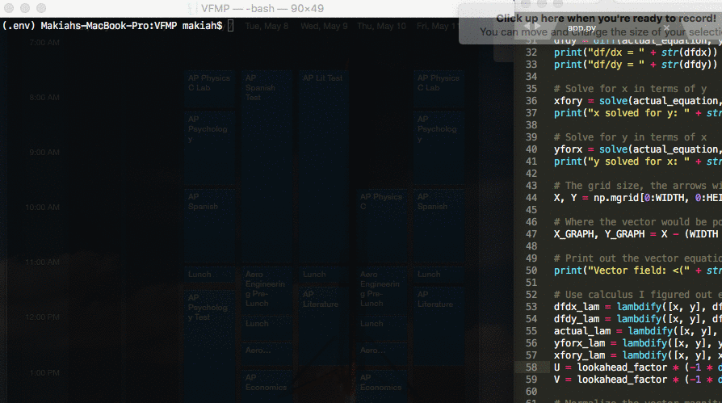
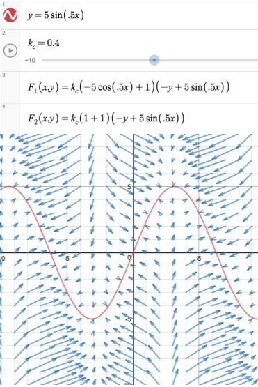
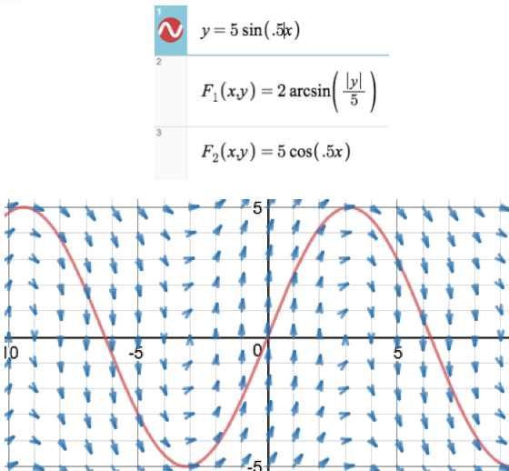
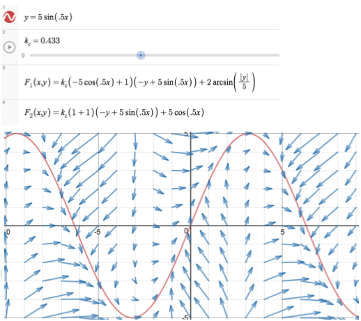
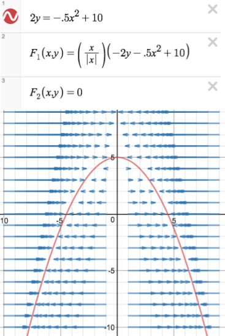
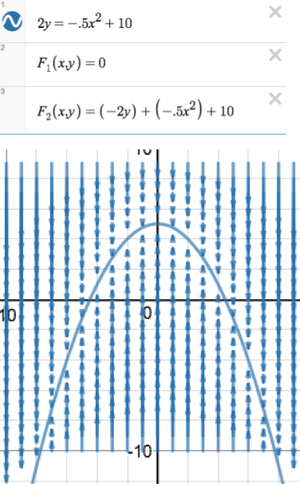
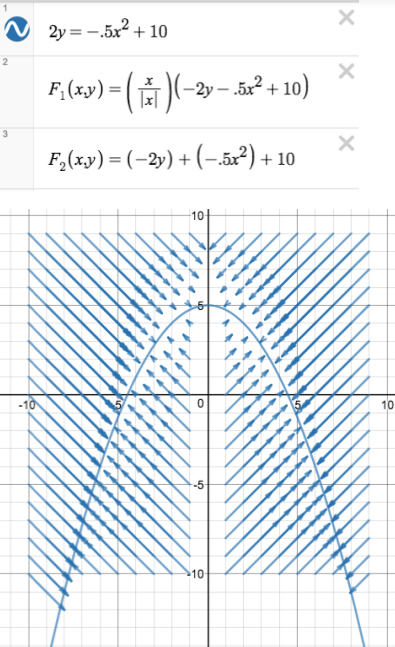
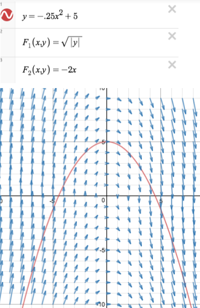
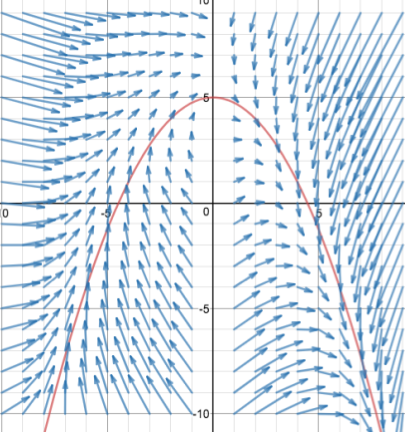

# Vector Field Motion Profiling

*Please note that this is incomplete, but explains the general idea behind using vector fields to profile a curve.* 

Path generation via vector fields is a simple multivariable calc formula, which you can view in `app.py`.  

These fields can be used to profile a robot to a given spline, provided you know the equation for the spline and the robot's approximate <x,y> position vector.  

## Example of field generation

## Desmos-Based Example

Now uses derivative as a coefficient for more advanced correction

### XY Correction 

### Path Correction 

### XY Correction 

## Legacy Work

### X Correction

### Y Correction

### XY Correction

### Path Correction (x^2)

### Combined Correction

